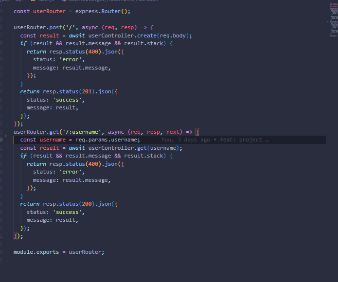
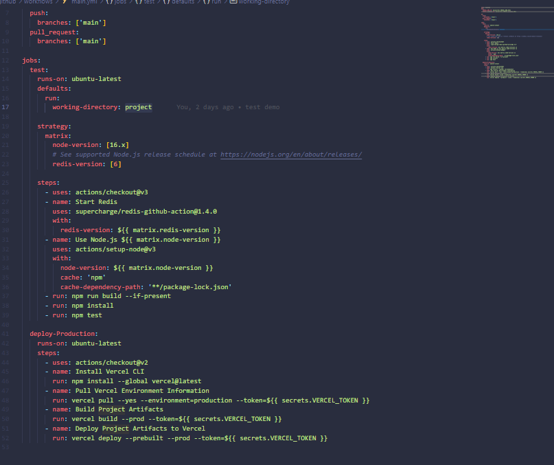
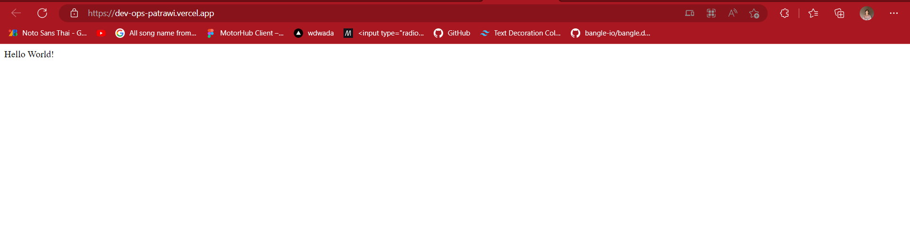
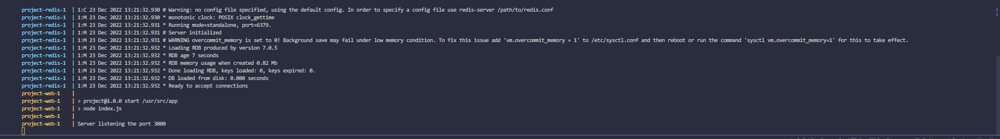
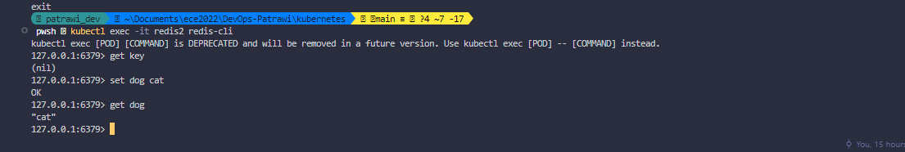
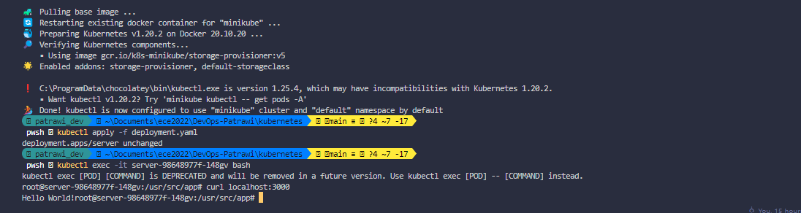

##DEVOPS FINAL PROJECT

## 1. Create a Web Application

In this project, I use the project template from userapi as the base for my web application using [NodeJS](https://nodejs.org/en/). However, I change some parts of codes from callback function to asynchronous funtion in order to prevent the callback hell.

## 2. Apply CI/CD pipeline

Here is the link to Where I deploy this project (PROJECT)[https://dev-ops-patrawi.vercel.app/]
For this section, I use [github action](https://github.com/features/actions) as a tool for making CI/CD, but I deploy it on (Vercel application)[https://vercel.com/] instead of Heroku because other applications that are mine also deploy here too. In the **main.yml**, it creates redis as well as build my project, then it deploy everything on vercel using 3 different keys which are **VERCEL_TOKEN**, **VERCEL_ORG_ID**, **VERCEL_PROJECT_ID**.

## 3. Configure and provision a virtual environment and run your application using the IaC approach

## 4. Build Docker image of your application

I use Docker to create a Dockerfile making an image for my application, and I also push it on the remote repository on Docker hub. You can find my image in the link below
[My Image](https://hub.docker.com/r/dogeceptionpp123/devops_project)

## 5. Make container orchestration using Docker Compose

I create a docker-compose.yml for making a orchestration for my project. There are 2 services which are redis and app.

## 6. Make docker orchestration using Kubernetes

In this part, I use kubernete with the minikube to orchestrate my app by creating the deployment, service, and the persistent volume for my redis database.

## 7. Make a service mesh using Istio

## 8. Implement Monitoring to your containerized application
