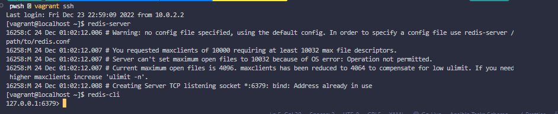
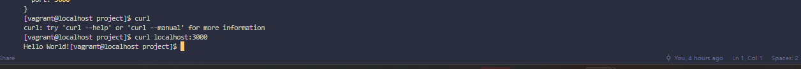
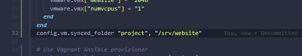
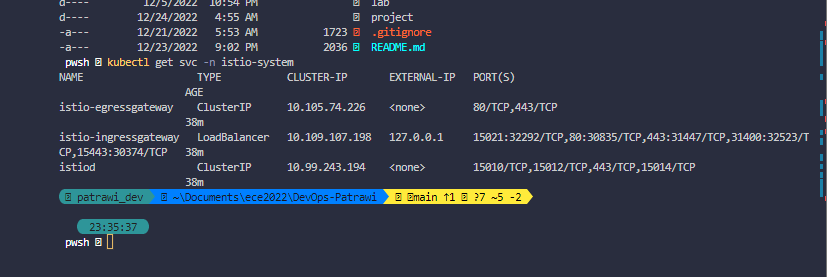
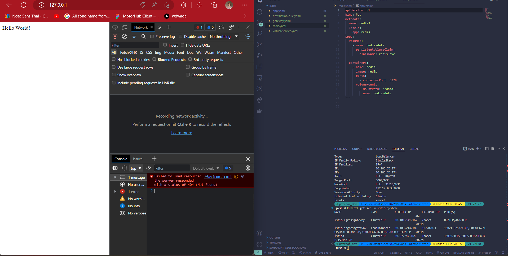
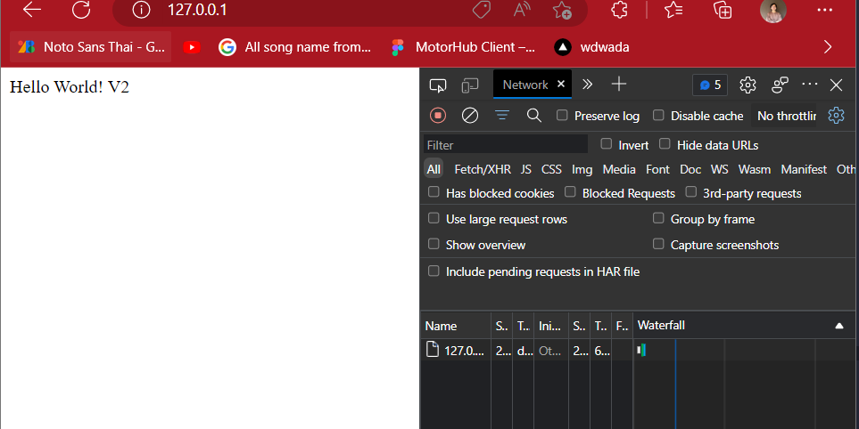
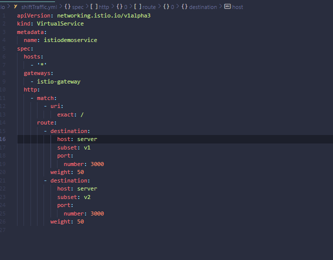

# DEVOPS FINAL PROJECT

In this project, a web application was created using NodeJS as the base. The application was modified to use asynchronous functions in order to prevent callback hell and a healthcheck was also added. The project was deployed using a CI/CD pipeline with GitHub Actions and Vercel.

A virtual environment was configured and provisioned using Vagrant and ansible, and the application was run using the Infrastructure as Code (IaC) approach. A Docker image of the application was also created and pushed to a remote repository on Docker Hub.

Container orchestration was implemented using Docker Compose and Kubernetes, and a service mesh was created using Istio. The project was tested and the results were documented.

## Running the Application

To run the application, follow these steps:

1. Install the dependencies:

```
    yarn install || npm instal
```

2. Start the project:

```
    yarn start
```

3. Run tests:

```
    yarn test
```


## CI/CD Pipeline

Here is the link to Where I deploy this project (PROJECT)[https://dev-ops-patrawi.vercel.app/]
For this section, I use [github action](https://github.com/features/actions) as a tool for making CI/CD, but I deploy it on (Vercel application)[https://vercel.com/] instead of Heroku because other applications that are mine also deploy here too. In the **main.yml**, it creates redis as well as build my project, then it deploy everything on vercel using 3 different keys which are **VERCEL_TOKEN**, **VERCEL_ORG_ID**, **VERCEL_PROJECT_ID**.

#### You don't have to do anything to run this because you only need to push it then the github action will do the rest.

```
git push origin main
```


## 3. Configure and provision a virtual environment and run your application using the IaC approach

For IaC part, I use redis along with my project to run on the Virtual machine using vagrant and ansible as well as using sync folders. I also create the healthcheck for it.

```
    vagrant up
    vagrant provision ## in case you already run previous line before
    vagrant ssh  ## access secure shell
    redis-cli ## access redis
    curl localhost:3000 ## access server
```





## 4. Build Docker image of your application

I use Docker to create a Dockerfile making an image for my application, and I also push it on the remote repository on Docker hub. You can find my image in the link below
[My Image](https://hub.docker.com/r/dogeceptionpp123/devops_project)

#### Run on local machine:

```
    docker build -t [image's name] .
    docker run -d --name [container's name] -p [port] [image's name]

```

#### Push to the docker hub:

```
    docker tag [image's name] [your username]/[repo's name]
    docker push [your username]/[repo's name]
```

## 5. Make container orchestration using Docker Compose

I create a docker-compose.yml for making a orchestration for my project. There are 2 services which are redis and app.


```
    docker-compose up
```

## 6. Make docker orchestration using Kubernetes

In this part, I use kubernete with the minikube to orchestrate my app by creating the deployment, service, and the persistent volume for my redis database.

```
kubectl apply -f [folder's name] ## For running every files in the folder
kubectl apply -f [file]
```


## 7. Make a service mesh using Istio

For making a service mesh using Istio, I create 2 different versions and push them on docker hub so that I can pull it for deployment helping me to connect, secure, control, and observe the interactions between your services, especially in a microservice architecture. I code 5 different files for deploying, route requesting, and shifting traffic. The first file is app.yaml used for deploying pods as well as service. The second file is about the destinationRule.yaml. This file tells istio about the different types of services that are in our deployment and the labels that they can be referenced by. In this case, we have two versions of the istio-node host (v1 and v2). Next, it's shiftTraffic.yaml which is about shift traffic from one version to another. You can apply weights to the subsets, and increase or decrease the weights as needed to a new version of a microservice. The fourth file is about gateway.yaml for accepting traffic for mesh. The last one is about mapping this virtual service to the deployment that we previously creat(ed, where we created an app named istio-node. Below is a picture as well as video for this lab

```
    minikube config set driver docker
    minikube start --memory=15000 --cpus=4 --kubernetes-version=v1.20.2 ## For the memory, it depends on how much ram do you have
    minikube tunnel


```

#### Open another terminal::

```
    istioctl install --set profile=demo -y
    kubectl label namespace default istio-injection=enabled
    kubectl apply -f [folder's name] or [file's name]
```

#### Gateway:


#### Request Routing:



#### Shift Traffic


# All Neccessary Links

1. [1st image](https://hub.docker.com/r/dogeceptionpp123/devops_project)
2. [2nd image](https://hub.docker.com/r/dogeceptionpp123/dev_opv2)
3. [My deployed website](https://dev-ops-patrawi.vercel.app/)

## Author
### Wareetanyarat Pirawat [my github](https://github.com/patrawi)
